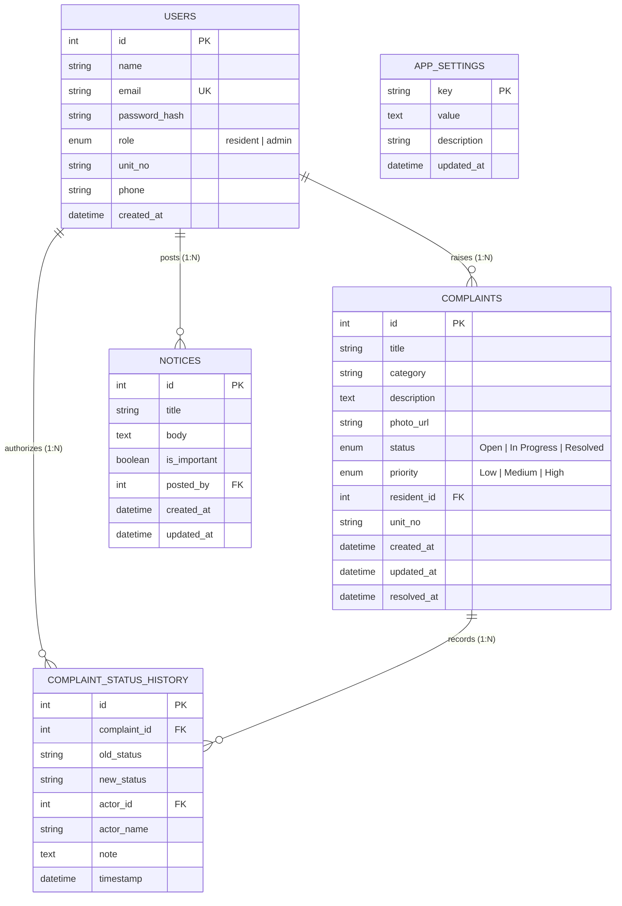

# Database Schema & Entity Relationship Model

The database is built on SQLAlchemy ORM and supports SQLite (local zero-setup development) and PostgreSQL (production).

## Entity Relationship (ER) Diagram

---

## Table Specifications

### 1. `users`
| Column | Type | Constraints | Description |
|---|---|---|---|
| `id` | Integer | Primary Key, Auto-increment | Unique identifier |
| `name` | String(100) | NOT NULL | User's full name |
| `email` | String(150) | NOT NULL, Unique, Indexed | User login email |
| `password_hash` | String(255) | NOT NULL | Bcrypt hashed password |
| `role` | Enum | NOT NULL, Default: `'resident'` | `'resident'` or `'admin'` |
| `unit_no` | String(50) | Nullable | Apartment flat/unit details |
| `phone` | String(20) | Nullable | Contact phone number |
| `created_at` | DateTime | NOT NULL, Default: UTC Now | Account creation timestamp |

### 2. `complaints`
| Column | Type | Constraints | Description |
|---|---|---|---|
| `id` | Integer | Primary Key, Auto-increment | Unique complaint number |
| `title` | String(200) | NOT NULL | Brief summary of maintenance issue |
| `category` | String(50) | NOT NULL | Plumbing, Electrical, Carpentry, etc. |
| `description` | Text | NOT NULL | Detailed description of fault |
| `photo_url` | String(500) | Nullable | Relative path to uploaded evidence |
| `status` | Enum | NOT NULL, Default: `'Open'` | `'Open'`, `'In Progress'`, `'Resolved'` |
| `priority` | Enum | NOT NULL, Default: `'Medium'` | `'Low'`, `'Medium'`, `'High'` |
| `resident_id` | Integer | Foreign Key &rarr; `users.id` | Complaint submitter |
| `unit_no` | String(50) | Nullable | Physical location in society |
| `created_at` | DateTime | NOT NULL, Default: UTC Now | Submission date/time |
| `updated_at` | DateTime | NOT NULL, Auto-update | Last modification time |
| `resolved_at` | DateTime | Nullable | Timestamp when marked Resolved |

### 3. `complaint_status_history`
| Column | Type | Constraints | Description |
|---|---|---|---|
| `id` | Integer | Primary Key, Auto-increment | Audit log entry ID |
| `complaint_id` | Integer | Foreign Key &rarr; `complaints.id` | Associated complaint |
| `old_status` | String(50) | Nullable | Prior status (null on creation) |
| `new_status` | String(50) | NOT NULL | Newly applied status |
| `actor_id` | Integer | Foreign Key &rarr; `users.id`, Nullable | User ID making the change |
| `actor_name` | String(100) | NOT NULL | Display name of actor |
| `note` | Text | Nullable | Admin note or explanation |
| `timestamp` | DateTime | NOT NULL, Default: UTC Now | Audit occurrence time |

### 4. `notices`
| Column | Type | Constraints | Description |
|---|---|---|---|
| `id` | Integer | Primary Key, Auto-increment | Notice entry ID |
| `title` | String(255) | NOT NULL | Notice headline |
| `body` | Text | NOT NULL | Body content |
| `is_important` | Boolean | NOT NULL, Default: `False` | Pinned / High priority flag |
| `posted_by` | Integer | Foreign Key &rarr; `users.id` | Admin who posted the notice |
| `created_at` | DateTime | NOT NULL, Default: UTC Now | Publish timestamp |
| `updated_at` | DateTime | NOT NULL, Auto-update | Edit timestamp |

### 5. `app_settings`
| Column | Type | Constraints | Description |
|---|---|---|---|
| `key` | String(100) | Primary Key | Setting name (e.g. `overdue_threshold_days`) |
| `value` | Text | NOT NULL | Serialized setting value |
| `description` | String(255) | Nullable | Setting explanation |
| `updated_at` | DateTime | NOT NULL, Auto-update | Last modified timestamp |
