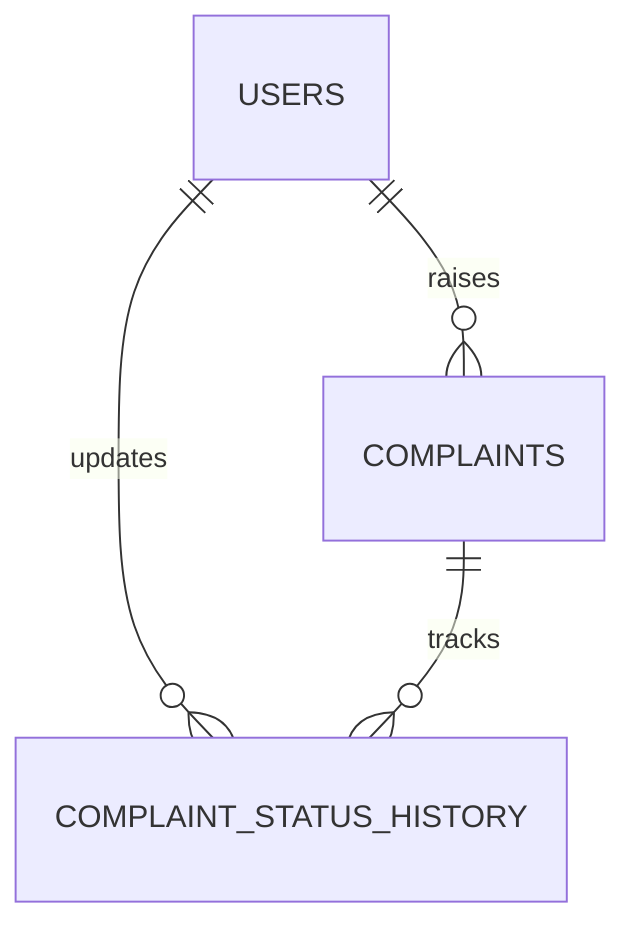
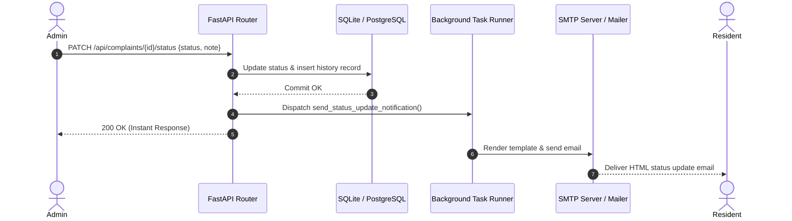

# Flatinel — System Design Write-Up

## 1. Complaint History Model

The complaint tracking subsystem uses an append-only audit trail pattern implemented via the `ComplaintStatusHistory` entity to guarantee immutability, complete observability, and accountability throughout the maintenance lifecycle.



- **Lifecycle Transitions**: Valid states follow a directed progression: `Open` &rarr; `In Progress` &rarr; `Resolved`. When transitioned to `Resolved`, a complaint is permanently closed (`resolved_at` timestamp is set) to prevent further state modifications.
- **Audit Granularity**: Every state change atomically inserts a history record containing `(complaint_id, old_status, new_status, actor_id, actor_name, note, timestamp)`. 
- **Actor Attribution**: Both resident creations and administrative actions (with optional operational notes like *"Technician dispatched for 2 PM"*) are captured.
- **Query Performance**: The status history is indexed by `complaint_id` with composite timestamp ordering, enabling $O(1)$ latest-state checks and swift chronological timeline reconstruction in the UI.

---

## 2. Overdue Detection Architecture

Overdue detection is designed as a hybrid runtime evaluation backed by configurable business parameters, avoiding brittle cron state-synchronization while providing real-time accuracy.

- **Dynamic Computation Engine**: A complaint is identified as overdue when:
  $$\text{is\_overdue} = (\text{status} \neq \text{Resolved}) \land (\text{now} - \text{created\_at} \ge \text{threshold\_days})$$
- **Configurable Persistence**: Rather than hardcoding SLA limits, the threshold (default: 3 days) is stored in the `app_settings` key-value table and exposed to administrators via `GET/PUT /api/settings/overdue-threshold`.
- **Query & Triage Priority**: When an administrator requests complaints (`GET /api/complaints`), the backend dynamically calculates `days_open` and `is_overdue` for each active record. Overdue issues are prioritized with primary sorting weights, forcing delinquent complaints to surface immediately at the top of the admin queue with high-visibility alert badges.

---

## 3. Photo Evidence Handling

Photo evidence is managed through a secure, multi-stage validation and local/cloud storage pipeline designed for high performance and low storage overhead.

```
[Resident Client] 
      │ (Multipart File Stream)
      ▼
[FastAPI Upload Handler] ──> [MIME & Size Validation (Max 5MB)]
      │
      ▼
[UUID Filename Sanitizer] ──> [Disk / Blob Store: /uploads/{uuid}.jpg]
      │
      ▼
[Return Public URL] ──> [Persisted in Complaint Record]
```

- **Validation & Sanitization**: Incoming multipart file streams undergo strict MIME-type inspection (whitelisting `image/jpeg`, `image/png`, `image/webp`) and stream-level byte quota enforcement (max 5MB) to mitigate denial-of-service via large payload uploads.
- **Filename Randomization**: Uploaded files are renamed using cryptographically secure UUIDv4 hashes (`{uuid4}.{ext}`) to neutralize directory traversal attacks and prevent filename collisions.
- **Serving & Extensibility**: Files are served statically via FastAPI's `StaticFiles` mount at `/uploads/`. The modular storage adapter pattern allows zero-downtime transition to S3, Cloudinary, or Supabase Storage without altering core complaint schemas.

---

## 4. Notification & Event Flow

The notification architecture employs asynchronous background task execution to decouple transactional database mutations from third-party I/O latency.



- **Decoupled Asynchrony**: When an admin updates complaint status or publishes a pinned notice (`is_important=True`), FastAPI commits the database transaction and immediately delegates email rendering and transport to `fastapi.BackgroundTasks`. The client receives an immediate $<20\text{ms}$ response.
- **Dual-Mode Adapter & Resiliency**: The email service supports standard SMTP (Gmail, Brevo, SendGrid, Mailgun) with TLS. If SMTP credentials are not configured, the system gracefully falls back to structured local logging without raising uncaught exceptions or interrupting user workflows.
- **Broadcast Optimization**: Important notices trigger batch notifications across all active resident accounts with responsive HTML email templates.
